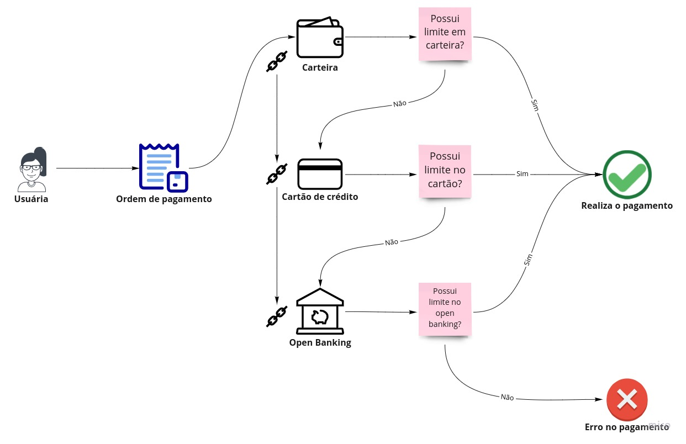

# Chain of Responsibility Pattern
* Nesse projeto de foi utilizado a simulação de um case que realiza o pagamento de uma ordem de pagamento. O pattern foi aplicado na chamada do método que fará o pagamento, nesse método é feito o encadeamento das formas de pagamento, que são [**WALLET**](https://github.com/kaikeventura/chain-of-responsibility-pattern/blob/main/src/main/java/com/kaikeventura/wallet/commanders/WalletCommander.java#L15-L27), [**CREDIT_CARD**](https://github.com/kaikeventura/chain-of-responsibility-pattern/blob/main/src/main/java/com/kaikeventura/wallet/commanders/CreditCardCommander.java#L15-L27) e [**OPEN_BANKING**](https://github.com/kaikeventura/chain-of-responsibility-pattern/blob/main/src/main/java/com/kaikeventura/wallet/commanders/OpenBankingCommander.java#L15-L27).
* Quando o [método](https://github.com/kaikeventura/chain-of-responsibility-pattern/blob/main/src/main/java/com/kaikeventura/wallet/Application.java#L26) de pagamento é chamado, é feito uma verificação se os mesmo possui limite suficiente, caso tenha limite é realizado o pagamento, caso não tenha limite é chamado a próxima forma de pagamento.
* A imagem abaixo descreve um fluxograma do processo do pagamento de uma ordem de pagamento.
# 
## Referências
* https://refactoring.guru/pt-br/design-patterns/chain-of-responsibility
* https://github.com/iluwatar/java-design-patterns/tree/master/chain-of-responsibility